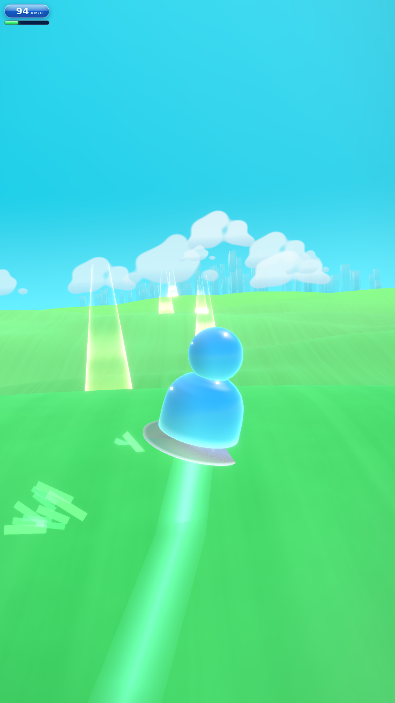

# 🌐 FRUTIGER SURFER

> Un bonhomme MSN en verre qui surfe sur un CD à travers des plaines d'herbe
> électrique, vers une ville de cristal.

Une expérience WebGL temps réel qui reconstruit — et fait vivre — l'esthétique
**Frutiger Aero** : verre, gloss, nature + technologie, bloom, et cette lumière
de fond d'écran Windows Vista qu'on n'a jamais vraiment oubliée.

Deux jauges a l'ecran, pas une de plus : la vitesse et le boost. Tout le
reste du retour est diegetique — un son pour les cretes, la couleur pour la
charge, l'image qui sature avec le combo.

Le cœur du projet, ce n'est pas la scène. C'est **la glisse**.

<p align="center">
  
  
</p>

## Lancer

```bash
npm install
npm run dev     # http://localhost:5173
```

## Jouer

| Action | Clavier | Tactile | Manette |
|---|---|---|---|
| Diriger | `←` `→` / `A` `D` | glisser le doigt posé | stick gauche |
| Armer / sauter | maintenir puis **relâcher** `Espace` | **poser le doigt**, puis lever | `A` |
| Planer | re-maintenir après l'apex | reposer le doigt en vol | `A` |
| Boost | `Maj` | deux doigts | `RT` |

**Les colonnes ambre** plantées dans la plaine donnent une poussée immédiate et
rechargent la jauge. Elles sont semées en slalom : les enchaîner demande de
tourner.

> **Sur mobile, un seul doigt fait tout.** Il reste posé : le glisser
> latéralement dirige, sa durée d'appui arme le saut, et le lever déclenche.
> Un deuxième doigt boost.

**Le relief** : le terrain est procédural et vallonné. Le saut se déclenche au
**relâchement**, pas à l'appui — maintiens pour armer l'élan en voyant la crête
arriver, et lâche **pile au sommet**. Un son monte d'une octave pour te dire où
il est. Élan et timing sont deux multiplicateurs indépendants : rater l'un
n'annule pas l'autre, mais il faut les deux pour un grand saut.

Re-maintiens après l'apex pour **planer** : la gravité tombe à 20 %, la vitesse
se maintient, et une impulsion de portance à l'ouverture donne la sensation
d'accrocher l'air. Elle ne se prend qu'une fois par vol.

Retombe dans une **pente descendante** : ça amortit et ça relance.

**Le boost est une ressource**, pas une touche à tenir. Les figures le
remplissent — slalom, sauts timés, planés, réceptions propres — et le boost le
vide. À dépense égale, jouer proprement rapporte plus du double.

**La boucle** : tiens un virage pour charger la carre — le disque se met sur la
tranche, le spray s'intensifie, le son monte d'une tierce. Relâche au bon moment
et tout se libère d'un coup : poussée, FOV qui s'ouvre, hitstop de 45 ms,
combo. Enchaîner gauche-droite est **plus rapide** que la ligne droite.

## Vérifier le rendu

```bash
npm run build         # typecheck + bundle de prod
npm run build:single  # page autonome unique, tout inline (mobile, partage)
npm run check         # verifie que le carve est plus rapide que la ligne droite
npm run shot          # capture Playwright, a comparer a docs/reference.jpg
```

`build:single` produit `dist-single/artifact.html` : un seul fichier, sans
requete externe, qui se pose n'importe où et s'ouvre tel quel sur un
téléphone. La page n'a aucun mobilier — le jeu occupe tout l'écran.

Les deux `check` simulent le contrôleur **sans rendu** : si le feeling dépend
d'un effet visuel, c'est que les ressorts sont ratés.

- `check` : le carve enchaîné doit battre la ligne droite. Actuellement **+52 %**.
- `check:air` : cinq pilotes automatiques sur le même terrain. Chaque palier de
  maîtrise doit payer — tap **0,86 s** de vol par saut → armé **1,25 s** →
  timé **1,83 s** → plané **3,18 s**. Le terrain seul ne doit pas envoyer en
  l'air plus de 30 % du temps en croisière (actuellement 1 %) sinon c'est un
  trampoline, et les figures doivent rapporter plus de boost que la recharge
  passive, à dépense égale.
- `check:input` : pilote un vrai navigateur, au clavier **et au tactile**. Les
  deux contrôles précédents pilotent `jumpHeld` directement — ils valident le
  modèle de saut, jamais le chemin qui va de l'événement au contrôleur. C'est
  exactement là que le saut tactile s'est cassé sans que rien ne le voie.

`scripts/shot.mjs` accepte `SHOT_DRIVE` pour piloter une pose précise :

```bash
SHOT_DRIVE="wait:500;KeyZ:50;down:ShiftLeft;wait:4000;down:ArrowRight;wait:1500" npm run shot
```

## Le personnage

<p align="center">
  
</p>

Silhouette et dégradé relevés au pixel sur la référence, puis calés par
comparaison côte à côte — c'est ce montage qui a servi de juge, pas l'œil nu.
Le détail du raisonnement est dans [`docs/01`](docs/01-ART-DIRECTION.md) §3.

## Documentation

| Doc | Contenu |
|---|---|
| [`docs/00-REFERENCE-ANALYSIS.md`](docs/00-REFERENCE-ANALYSIS.md) | Analyse forensique de l'image de référence |
| [`docs/01-ART-DIRECTION.md`](docs/01-ART-DIRECTION.md) | Palette, matériaux, lumière, post-process |
| [`docs/02-TECH-ARCHITECTURE.md`](docs/02-TECH-ARCHITECTURE.md) | Stack, modules, pipeline de rendu, budget perf |
| [`docs/03-GAME-FEEL.md`](docs/03-GAME-FEEL.md) | Spec de la glisse — la partie qui doit être jouissive |
| [`docs/04-ROADMAP.md`](docs/04-ROADMAP.md) | Jalons de production |
