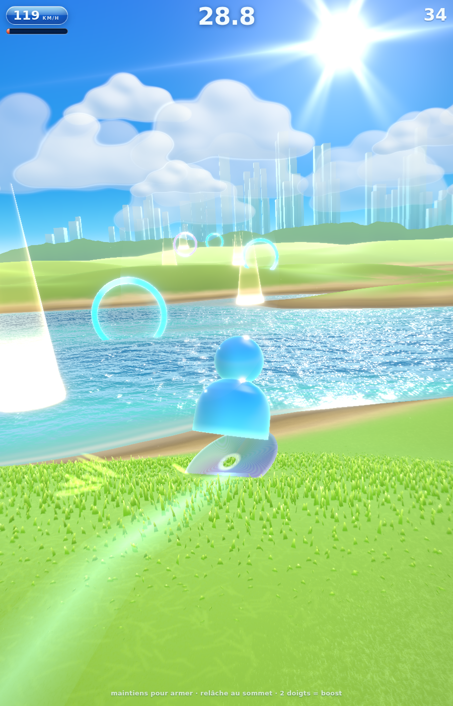
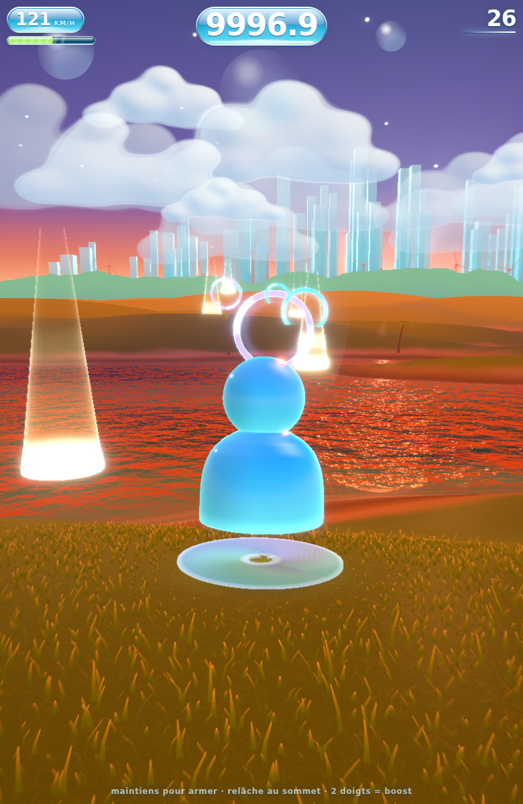
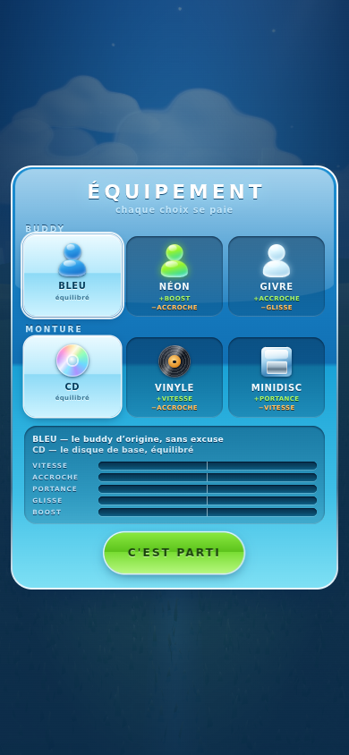
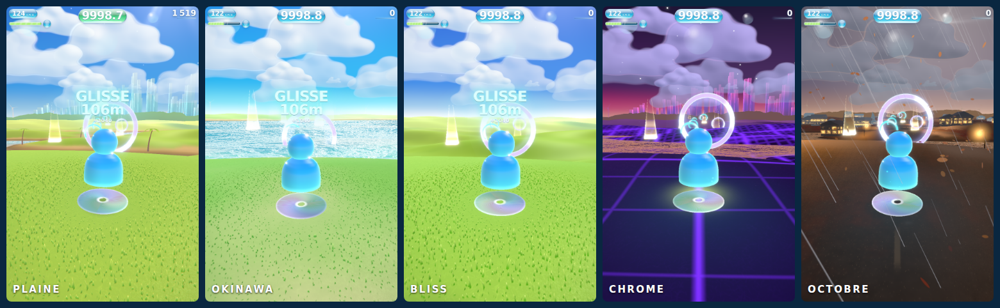
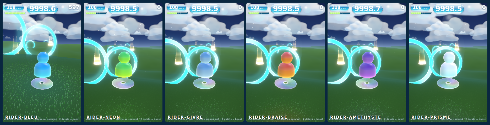
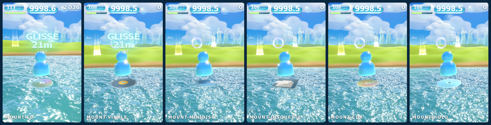
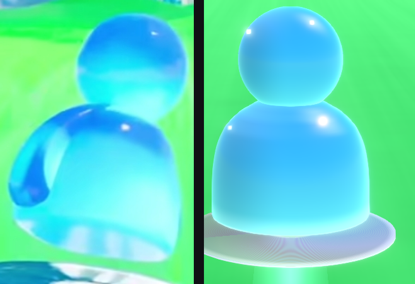

# 🌐 FRUTIGER SURFER

> Un bonhomme MSN en verre qui surfe sur un CD à travers des plaines d'herbe
> électrique, vers une ville de cristal.

Une expérience WebGL temps réel qui reconstruit — et fait vivre — l'esthétique
**Frutiger Aero** : verre, gloss, nature + technologie, bloom, et cette lumière
de fond d'écran Windows Vista qu'on n'a jamais vraiment oubliée.

Azur profond au zénith qui blanchit à l'horizon, cumulus volumétriques éclairés
par une vraie normale, soleil en étoile dans le cadre, plaine dont le relief se
lit par la hauteur et non par la pente, ligne d'arbres et skyline de cristal sur
l'horizon. Le détail de chaque décision est dans
[docs/01-ART-DIRECTION.md](docs/01-ART-DIRECTION.md) §6.

**Une partie dure 30 secondes.** Chaque anneau de verre franchi t'en rend
trois, chaque colonne de vitesse une, chaque tour complet en l'air presque une.
Le sablier accélère : à toi de tenir. Le record est gardé, la relance est
instantanée.

Le cœur du projet, ce n'est pas la scène. C'est **la glisse**.

<p align="center">
  
  
  
</p>

**Le jour tourne.** Un cycle complet fait trois minutes et ne se remet jamais à
zéro entre deux parties : on part en fin de matinée, on finit au soleil rasant,
et la partie suivante n'a pas la même lumière. Aube froide en haut et déjà
chaude en bas, midi Frutiger Aero, crépuscule violet sur braise, nuit claire de
pleine lune — jamais noire, un jeu de vitesse qui s'éteint devient injouable.

## Lancer

```bash
npm install
npm run dev     # http://localhost:5173
```

## Jouer

| Action | Clavier | Tactile | Manette |
|---|---|---|---|
| Diriger | `←` `→` / `A` `D` | glisser le doigt posé | stick gauche |
| Armer / sauter | maintenir puis **relâcher** `Espace` | **poser le doigt**, puis lever | `A` |
| Planer | re-maintenir après l'apex | reposer le doigt en vol | `A` |
| Vriller | direction à fond **en l'air** | glisser à fond en vol | stick à fond |
| Boost | `Maj` | deux doigts | `RT` |
| Rejouer | n'importe quelle touche | tap | `A` |

**Les anneaux de verre** sont l'objectif. Les **cyans** sont plantés dans
l'herbe : on les enfile en glissant, ils rendent 3 s. Les **violets** flottent à
9 m : il faut un saut armé et bien timé, ils rendent 4 s et paient le double. La
couleur te dit s'il faut sauter avant que tu aies jugé la hauteur.

**Les vrilles** : tiens la direction à fond en l'air, un tour prend 0,65 s. Seuls
les tours complets comptent, et ils paient en carré — deux tours valent quatre
fois un tour. Mais vriller **étouffe le contrôle latéral** : le disque présente
sa tranche, il ne mord plus l'air. Tourner, c'est renoncer à corriger sa
trajectoire. Astuce : vrille **du côté** de l'anneau suivant, la figure et la
visée vont alors dans le même sens.

**Les colonnes ambre** plantées dans la plaine donnent une poussée immédiate et
rechargent la jauge. Elles sont semées en slalom : les enchaîner demande de
tourner.

> **Sur mobile, un seul doigt fait tout.** Il reste posé : le glisser
> latéralement dirige, sa durée d'appui arme le saut, et le lever déclenche.
> Un deuxième doigt boost.

**Le relief** : le terrain est procédural et vallonné. Le saut se déclenche au
**relâchement**, pas à l'appui — maintiens pour armer l'élan en voyant la crête
arriver, et lâche **pile au sommet**. Un son monte d'une octave pour te dire où
il est. Élan et timing sont deux multiplicateurs indépendants : rater l'un
n'annule pas l'autre, mais il faut les deux pour un grand saut.

Re-maintiens après l'apex pour **planer** : la gravité tombe à 20 %, la vitesse
se maintient, et une impulsion de portance à l'ouverture donne la sensation
d'accrocher l'air. Elle ne se prend qu'une fois par vol.

Retombe dans une **pente descendante** : ça amortit et ça relance.

**L'eau** : des lacs coupent la plaine toutes les neuf secondes environ. Arrive
au-dessus de 25 m/s et le disque **porte** — il laisse un sillage en V, le
relief cesse d'un coup de se faire sentir, et la traversée est payée à la sortie
en points, en combo, en boost et en secondes. Arrive plus lentement et tu
**coules** : le buddy s'enfonce jusqu'au cou, la vitesse tombe à rien, et tu
ressors de l'autre rive au pas. C'est le seul obstacle du jeu qui teste la
vitesse plutôt que la visée.

**Le boost est une ressource**, pas une touche à tenir. Les figures le
remplissent — slalom, sauts timés, planés, réceptions propres — et le boost le
vide. À dépense égale, jouer proprement rapporte plus du double.

**La boucle** : tiens un virage pour charger la carre — le disque se met sur la
tranche, le spray s'intensifie, le son monte d'une tierce. Relâche au bon moment
et tout se libère d'un coup : poussée, FOV qui s'ouvre, hitstop de 45 ms,
combo. Enchaîner gauche-droite est **plus rapide** que la ligne droite.

## Les mondes

<p align="center">
  
</p>

Cinq mondes, et ce ne sont pas cinq palettes. Chacun a son relief, son
niveau d'eau, ses couleurs, son ciel et **ses règles**.

| Monde | Eau | Ce qu'on y joue |
|---|---|---|
| **PLAINE** | 17 % | l'équilibre de référence : collines, lacs toutes les neuf secondes, ville de cristal. |
| **OKINAWA** | 62 % | **la houle.** Un océan turquoise semé d'îles. On y déjauge à 8 m/s : impossible d'y couler, et c'est voulu — le risque déménage dans les vagues. Car la houle n'est pas un décor : elle porte une **pente** et une **courbure**, donc on la lit, on l'anticipe et on saute dessus, exactement comme une colline. Chaque crête franchie paie. |
| **BLISS** | 0 % | **les figures.** Que des collines et le ciel. Pas une goutte d'eau, donc plus de traversées à marquer : on n'a que le relief et l'air. |
| **CHROME** | 28 % | **la vitesse.** Grille néon, mercure, tours magenta, et le seul monde qui ne connaît pas le plein jour — un néon a besoin de nuit. |
| **OCTOBRE** | 31 % | **le vent.** Une route mouillée qui traverse un lotissement, sous une averse torrentielle : fenêtres allumées, lampadaires qui posent leur reflet sur l'asphalte, feuilles mortes et crépuscule de plomb. Le sol détrempé fait chasser le disque, et la rafale le **déporte** pour de bon — la même rafale qui couche l'herbe, emporte les feuilles et incline la pluie. On la voit arriver avant de la sentir. |

Un monde n'est pas une scène chargée à la place d'une autre : c'est un jeu de
paramètres appliqué à la même scène. Rien n'est détruit, aucun shader n'est
recompilé — **donc on peut fondre d'un monde à l'autre**. Touche OKINAWA et la
plaine s'inonde derrière le panneau pendant que tu lis la carte suivante.

Chaque monde tient **son propre record** : ils ne se font pas concurrence, et y
revenir ne coûte rien.

## Six buddies, six montures

<p align="center">
  
</p>

<p align="center">
  
</p>

Chaque buddy **projette sa lumière au sol** — une flaque de sa couleur qui
voyage avec lui sur l'herbe, le sable et l'eau. NÉON n'est pas peint en vert, il
**éclaire** en vert. Sans cette flaque, un personnage lumineux n'est qu'un
autocollant fluorescent.

Deux montures sont de vraies **cartouches carrées**, et ce n'est pas un caprice :
ce qui distingue une monture à quarante pixels n'est ni sa couleur ni sa
texture, c'est sa **silhouette**. Six disques ronds de teintes différentes se
ressemblent tous.

## L'aura, au-delà de 200 km/h

Passé 200 km/h le surfeur **prend feu** de sa propre couleur : une enveloppe qui
défile vers le haut, des langues qui la dépassent, et un cœur blanc. À 216 —
le plafond absolu du jeu — elle atteint son plein régime.

Elle n'est pas décorative : à pleine puissance elle **double le rayon et la
force de la lampe**. Ce n'est plus le personnage qui brille, c'est la plaine qui
change de couleur autour de lui.

## L'équipement

Trois buddies, trois montures, six combinaisons. **Chaque choix se paie** —
aucune option n'est meilleure qu'une autre sur tous les axes, sinon il n'y a pas
de choix, il y a une bonne réponse et cinq mauvaises.

| | Avantage | Coût |
|---|---|---|
| **BLEU** · **CD** | — | — |
| **NÉON** | recharge le boost, part plus vite | mord moins en virage |
| **GIVRE** | colle au sol | plafonne plus bas, déjauge plus tard |
| **VINYLE** | le plus rapide | tourne mal, saute mal |
| **MINIDISC** | vole et glisse | perd en vitesse de pointe |

Les étiquettes de l'écran sont **calculées depuis les multiplicateurs**, jamais
écrites à la main : un libellé rédigé survit toujours à l'équilibrage qui le
rend faux. Les cinq jauges du bas donnent le profil de la **combinaison**, pas
de la carte — le joueur ne joue pas un buddy et une monture, il joue leur
produit. Elles partent du centre parce que la grandeur intéressante est un écart
au neutre, et le coût est ambre et non rouge : le rouge dit l'erreur, or aucun
choix n'est une erreur.

On y revient **quand on veut** : un bouton dans la bande haute du HUD, ou Échap
au clavier. Et on en ressort par une croix qui **annule** — le monde survolé
revient à celui qu'on avait, le chrono reprend là où il s'était arrêté. L'écran
n'avait qu'une issue, « c'est parti », qui relance : l'ouvrir par curiosité au
milieu d'une course coûtait la course.

Pendant qu'on choisit, **le jeu ne se joue pas tout seul**. Le paysage vit — le
cycle jour/nuit tourne, la pluie tombe, le monde survolé se fond sous les yeux —
mais le surfeur attend : pas un mètre parcouru, pas un point marqué. Il continue
quand même à lire le sol sous lui, parce que le relief se transforme pendant
qu'on survole les mondes, et qu'un surfeur simplement figé finirait enterré dans
la colline.

Le choix se voit en jeu — le verre du buddy et la matière **et la taille** du
disque changent. Un écran de sélection qui ne change rien à l'écran suivant est
un écran qui ment.

L'écran s'ouvre au **premier lancement uniquement**, et depuis le panneau de
fin. Un menu imposé à chaque lancement tue le « encore une » d'un jeu de
quarante secondes.

## Jouer en ligne

Le dépôt se déploie **tel quel** sur Vercel : `vercel.json` fixe le framework
(Vite), la commande de build et `dist/` en sortie. Rien d'autre à configurer.

L'`installCommand` porte `PLAYWRIGHT_SKIP_BROWSER_DOWNLOAD=1` : Playwright est
une dépendance de développement — les vérifications pilotent un vrai navigateur —
et son script de post-installation télécharge plusieurs centaines de mégaoctets
dont un build de production n'a aucun usage.

Ajouter `?diag=1` à l'URL affiche une sonde de diagnostic. Elle lit le tampon de
dessin après chaque rendu — un flash d'une image ne se photographie pas — et
tranche la seule question qui compte quand l'écran clignote :

- `noires > 0` : le rendu est en cause, c'est réparable dans ce code ;
- `noires = 0` alors que ça clignote : le tampon était valide à chaque image, le
  noir vient du compositeur, de la page hôte ou d'un changement de thème.

## Vérifier le rendu

```bash
npm run build         # typecheck + bundle de prod
npm run build:single  # page autonome unique, tout inline (mobile, partage)
npm run check         # verifie que le carve est plus rapide que la ligne droite
npm run shot          # capture Playwright, a comparer a docs/reference.jpg
```

`build:single` produit `dist-single/artifact.html` : un seul fichier, sans
requete externe, qui se pose n'importe où et s'ouvre tel quel sur un
téléphone. La page n'a aucun mobilier — le jeu occupe tout l'écran.

Ces `check` simulent le contrôleur **sans rendu** (sauf `check:input`) : si le
feeling dépend d'un effet visuel, c'est que les ressorts sont ratés.

- `check` : le carve enchaîné doit battre la ligne droite. Actuellement **+52 %**.
- `check:air` : cinq pilotes automatiques sur le même terrain. Chaque palier de
  maîtrise doit payer — tap **0,86 s** de vol par saut → armé **1,25 s** →
  timé **1,83 s** → plané **3,18 s**. Le terrain seul ne doit pas envoyer en
  l'air plus de 30 % du temps en croisière (actuellement 1 %) sinon c'est un
  trampoline, et les figures doivent rapporter plus de boost que la recharge
  passive, à dépense égale.
- `check:input` : pilote un vrai navigateur, au clavier **et au tactile**. Les
  deux contrôles précédents pilotent `jumpHeld` directement — ils valident le
  modèle de saut, jamais le chemin qui va de l'événement au contrôleur. C'est
  exactement là que le saut tactile s'est cassé sans que rien ne le voie.
- `check:water` : traverse une vraie nappe à cinq vitesses, de part et d'autre
  des deux seuils. Les deux issues doivent rester atteignables et clairement
  séparées, l'hystérésis doit tenir (pas de glisse qui clignote au milieu du
  lac), et sortir en glissant doit laisser au moins **deux fois** la vitesse de
  sortir en coulant — sinon l'erreur ne coûte rien.
- `check:worlds` : les cinq mondes, **à l'autopilote**. Dès qu'un monde change
  le relief et l'eau, il change le jeu, et on peut en livrer un injouable — c'est
  arrivé. Le banc mesure la largeur de la nappe la plus large (traversable ?), la
  terre entre deux nappes (de quoi se relancer ?), la survie du pilote, le temps
  passé sous 22 m/s, et depuis Octobre le temps passé **collé au bord du
  couloir** : un vent qu'on ne peut pas contrer plaque le pilote contre la paroi
  et la trajectoire cesse d'être un choix.
- `check:town` : l'**invariant du décor ancré au monde**. Le quartier d'octobre
  suit le joueur par cellules ; le contenu d'une cellule ne doit dépendre que de
  sa position monde, jamais de son index d'instance — sinon tout le décor change
  de place quand la grille glisse, ce qui est arrivé et se voyait deux fois par
  seconde. Le banc est **statique** : mesurer l'image ne marchait pas (un
  lampadaire à l'horizon fait trois pixels, et le saut sortait à 1,08 fois le
  bruit de parallaxe), alors que l'invariant, lui, porte sur ce dont une
  fonction a le droit de dépendre.
- `check:artifact` : **le fichier réellement publié** démarre-t-il. Tout le reste
  de la suite tourne sur `index.html` servi par Vite ; l'artefact mono-fichier
  n'était chargé par rien, et il a été livré mort deux fois — un `<div>` ajouté à
  la page de développement que la coquille de l'artefact n'avait pas suivi. Le
  corps est désormais extrait d'`index.html` au lieu d'être recopié, et ce banc
  vérifie qu'il boote et que la simulation avance.
- `check:pick` : l'écran d'équipement, **au clic**. Tout le reste de la suite
  pilote le jeu par `window.__game`, ce qui ne prouve rien sur un écran dont
  l'unique interface est le doigt. Il vérifie que l'écran s'ouvre au premier
  lancement et seulement là, qu'un clic sur une carte puis sur la validation
  applique le choix à la physique **et** à la livrée, et que le choix survit au
  rechargement. Depuis, il mesure aussi deux défauts signalés en jeu : que le
  surfeur ne parcourt **pas un mètre** derrière le panneau, et qu'on peut y
  revenir puis en ressortir sans y laisser sa course.
- `check:shaders` : charge le jeu sur deux profils et échoue à la moindre erreur
  GLSL en console. C'est le seul filet contre cette classe de faute : un shader
  qui ne compile pas ne casse pas la page, il fait juste disparaître un maillage
  en silence. Le sol est resté plusieurs heures sans compiler sans que rien ne
  le dise.

`scripts/shot.mjs` accepte `SHOT_DRIVE` pour piloter une pose précise :

```bash
SHOT_DRIVE="wait:500;KeyZ:50;down:ShiftLeft;wait:4000;down:ArrowRight;wait:1500" npm run shot
```

## Le personnage

<p align="center">
  
</p>

Silhouette et dégradé relevés au pixel sur la référence, puis calés par
comparaison côte à côte — c'est ce montage qui a servi de juge, pas l'œil nu.
Le détail du raisonnement est dans [`docs/01`](docs/01-ART-DIRECTION.md) §3.

## Documentation

| Doc | Contenu |
|---|---|
| [`docs/00-REFERENCE-ANALYSIS.md`](docs/00-REFERENCE-ANALYSIS.md) | Analyse forensique de l'image de référence |
| [`docs/01-ART-DIRECTION.md`](docs/01-ART-DIRECTION.md) | Palette, matériaux, lumière, post-process |
| [`docs/02-TECH-ARCHITECTURE.md`](docs/02-TECH-ARCHITECTURE.md) | Stack, modules, pipeline de rendu, budget perf |
| [`docs/03-GAME-FEEL.md`](docs/03-GAME-FEEL.md) | Spec de la glisse — la partie qui doit être jouissive |
| [`docs/04-ROADMAP.md`](docs/04-ROADMAP.md) | Jalons de production |
